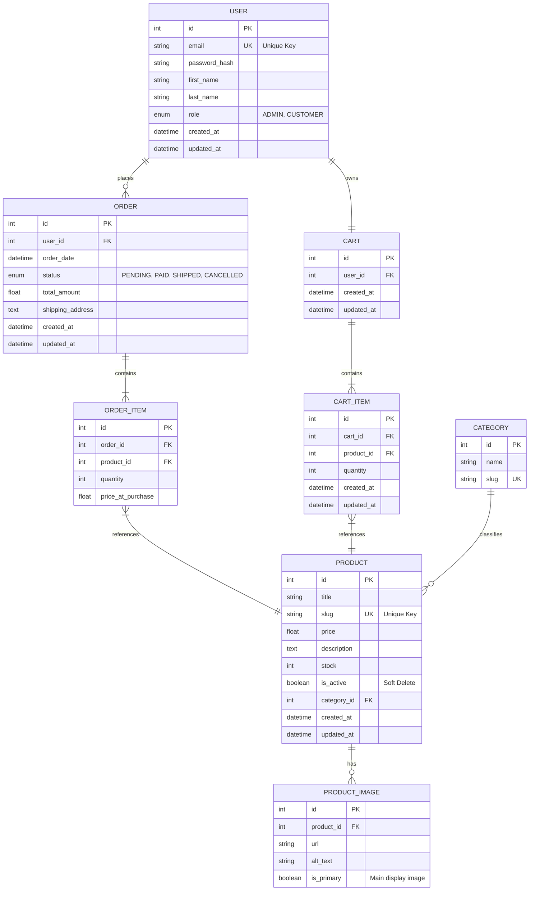

# Database Schema
This document outlines the database design for Boogie Neko.

## Entity Relationship Diagram

```mermaid
erDiagram
    %% USER MANAGEMENT
    USER ||--o{ ORDER : places
    USER ||--|| CART : owns
    
    %% ORDER MANAGEMENT
    ORDER ||--|{ ORDER_ITEM : contains
    ORDER_ITEM }|--|| PRODUCT : references

    %% CART MANAGEMENT
    CART ||--|{ CART_ITEM : contains
    CART_ITEM }|--|| PRODUCT : references

    %% PRODUCT CATALOG
    CATEGORY ||--o{ PRODUCT : classifies
    PRODUCT ||--o{ PRODUCT_IMAGE : has

    USER {
        int id PK
        string email UK "Unique Key"
        string password_hash
        string first_name
        string last_name
        enum role "ADMIN, CUSTOMER"
        datetime created_at
        datetime updated_at
    }

    PRODUCT {
        int id PK
        string title
        string slug UK "Unique Key"
        float price
        text description
        int stock
        boolean is_active "Soft Delete"
        int category_id FK
        datetime created_at
        datetime updated_at
    }

    PRODUCT_IMAGE {
        int id PK
        int product_id FK
        string url
        string alt_text
        boolean is_primary "Main display image"
    }

    CATEGORY {
        int id PK
        string name
        string slug UK
    }

    ORDER {
        int id PK
        int user_id FK
        datetime order_date
        enum status "PENDING, PAID, SHIPPED, CANCELLED"
        float total_amount
        text shipping_address
        datetime created_at
        datetime updated_at
    }

    ORDER_ITEM {
        int id PK
        int order_id FK
        int product_id FK
        int quantity
        float price_at_purchase
    }

    CART {
        int id PK
        int user_id FK
        datetime created_at
        datetime updated_at
    }

    CART_ITEM {
        int id PK
        int cart_id FK
        int product_id FK
        int quantity
        datetime created_at
        datetime updated_at
    }
```